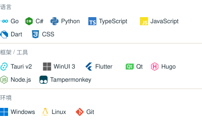
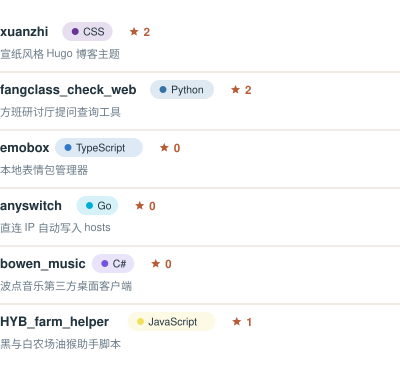

广州大学在读 · 桌面工具 / 用户脚本 / 小工具 · [博客](https://ldm0715.github.io) · [Repositories](https://github.com/ldm0715?tab=repositories)

## 技术栈

<picture>
  <source media="(min-width: 720px)" srcset="./assets/tech-stack-wide.svg" />
  
</picture>

## 精选项目

<picture>
  <source media="(min-width: 720px)" srcset="./assets/projects-wide.svg" />
  
</picture>
star 数与语言由 Action 每日更新 · <a href="https://github.com/ldm0715?tab=repositories">完整列表</a>

## GitHub 数据

 

## 贡献贪吃蛇

<picture>
  <source media="(prefers-color-scheme: dark)" srcset="https://raw.githubusercontent.com/ldm0715/ldm0715/output/github-snake-dark.svg" />
  <source media="(prefers-color-scheme: light)" srcset="https://raw.githubusercontent.com/ldm0715/ldm0715/output/github-snake.svg" />
  
</picture>

