

 

  


## 👋 关于我

- 🎓 广州大学在读，平时喜欢把「用着顺手」的小东西真的做出来
- 🧰 桌面端偏多：Tauri v2、WinUI 3、Flutter、PySide6 / Qt 都在折腾
- 🌏 常用语言：`Go` · `C#` · `Python` · `TypeScript` · `Dart` · `JavaScript`
- ✍️ 写博客，也写主题 —— 自己的 Hugo 主题 [xuanzhi](https://github.com/ldm0715/xuanzhi)
- 🔗 博客：[ldm0715.github.io](https://ldm0715.github.io) · 主页：[github.com/ldm0715](https://github.com/ldm0715)

## 🧱 技术栈

<!-- TECH:START -->
语言 
 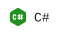  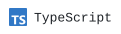 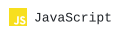   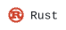  
框架 / 工具 
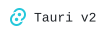 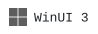    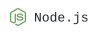   
环境 
 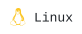 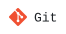
<!-- TECH:END -->

## 📌 精选项目

<!-- PROJECTS:START -->
<a href="https://github.com/ldm0715/bowen_music">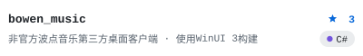</a>
<a href="https://github.com/ldm0715/emobox">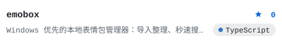</a>
<a href="https://github.com/ldm0715/BiliEmojiDD">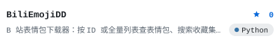</a>
<a href="https://github.com/ldm0715/fangclass_check_web">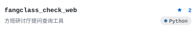</a>
<!-- PROJECTS:END -->

自动读取你 GitHub 上置顶的仓库，star 数与语言由 Action 每日更新 · <a href="https://github.com/ldm0715?tab=repositories">完整列表 →</a>

## 📊 GitHub 数据

数据由仓库内 <a href="./.github/workflows/profile-stats.yml">GitHub Action</a> 每日抓取并渲染为静态 SVG，不依赖任何第三方统计服务。

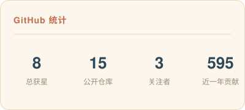 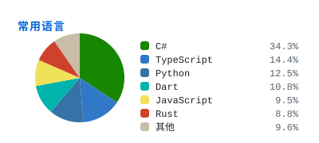

 

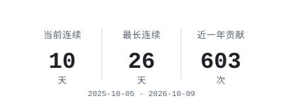

## 🐍 贡献贪吃蛇

